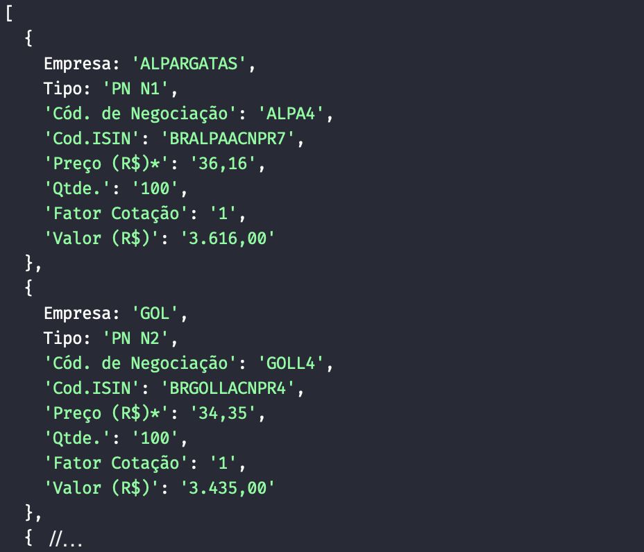

# cei-web-scraping

A solução aqui apresentada roda sobre a plataforma Node.js e tem por finalidade raspar dados do portal do investidor (Portal CEI). Este repositório é tão somente uma demonstração prática relacionada aos Posts:

 - [Node.js: web scraping com Puppeteer](https://medium.com/@fabiojanio/node-js-web-scraping-com-puppeteer-29dd974eb042); e
 - [Node.js + Express + ES6 + ESLint + Prettier + Sucrase de forma simples e rápida](https://medium.com/@fabiojanio/node-js-express-es6-eslint-sucrase-de-forma-simples-e-rápida-8467fcfae728)

 Screenshot:
 

## Como rodar

Este projeto fui construindo utilizando o gerenciador de pacotes YARN, porém, nada o impede de utilizar o NPM se assim preferir.

1 - Clone o repositório:

```
git clone https://github.com/fabiojaniolima/cei-web-scraping.git
```

2 - Instale as dependências

```
yarn install
```

> Lembrando que você é livre para utilizar o NPM.

3 - Renomei o arquivo `.env.sample` para `.env` e preencha os campos de usuário e senha

4 - Rode:

```
node src/index.js
```

Aguarde alguns instante e veja o resultado na console.

> Caso queira ver as ações acontecendo dentro da interface do navegador, altere no arquivo `.env` a flag `BACKGROUND_NAVIGATION` para `true`!

## :warning: Atenção

Observe que neste código não foram adicionados fluxos de tratamento de exceções, logo, para usos gerais e/ou fora do contexto de estudo, adicione tais tratamentos.

Observe ainda que este tipo de código possui caracteristicas fortemente bloqueantes, ou seja, seu fluxo quebra os principios de Non-Blocking I/O do Node.
